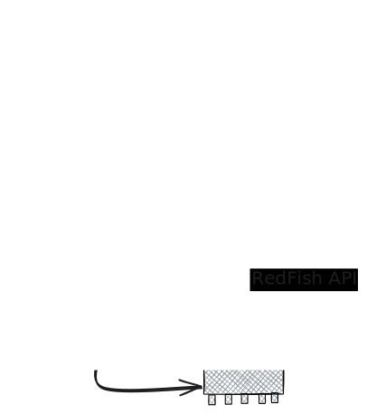

# ReadFish collector test



## Steps
1. `podman pull docker.io/dmtf/redfish-mockup-server:latest`
1. `podman run --rm -p 8080:8000 dmtf/redfish-mockup-server:latest`
1. Call API

## API call examples
``` bash
curl -v http://localhost:8080/redfish/v1
curl -v http://localhost:8080/redfish/v1
curl -v http://localhost:8080/redfish/v1/Chassis
curl -v http://localhost:8080/redfish/v1/Chassis/1U
curl -v http://localhost:8080/redfish/v1/Chassis/1U/PowerSubsystem
```
# Contribute

``` bash
python -m venv venv
source venv/bin/activate
make
make test
```

# References

## Redfish
* https://github.com/DMTF/Redfish-Mockup-Server
* https://github.com/DMTF/Redfish-Mockup-Creator

## Coding
https://docs.python-guide.org/writing/structure/

